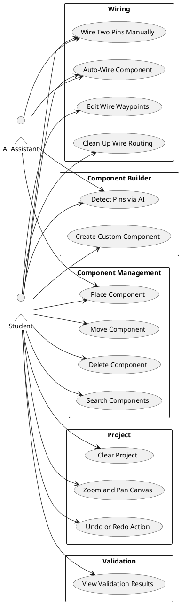
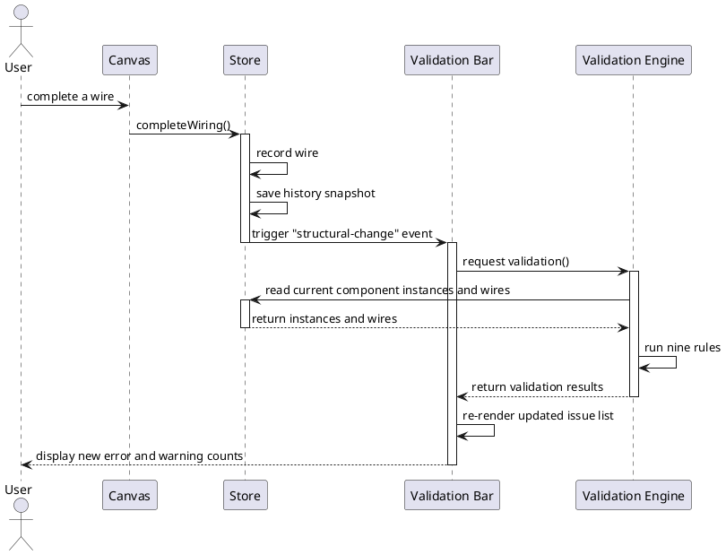
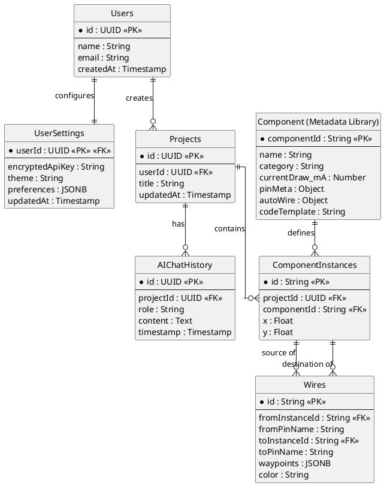

# Elera Architecture Diagrams

This document contains the consolidated PlantUML diagrams for the Elera project, including the Use Case Diagram, Sequence Diagram, and Entity-Relationship Diagram (ERD).

## 1. Use Case Diagram

## 2. Sequence Diagram (Validation Flow)

## 3. Entity-Relationship Diagram (ERD)

