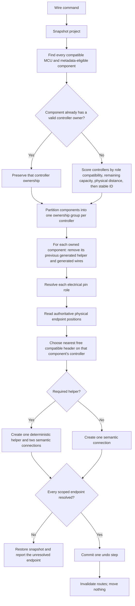

# Elera Auto Wire and Auto Layout Flow

This is the migration reference for restoring the pre-Konva Elera automation behavior inside the physical editor. The historical source is Git commit `05c4c0e` (2026-06-03), especially `src/services/auto-wire-engine.js`, `src/services/routing-engine.js`, `src/store.js`, and the toolbar orchestration in `src/circuit-app.js`.

The old engine operated on the legacy store and had no breadboard planner. Its useful behavior must be ported into the physical project model; the physical editor must not call the legacy store behind the canvas.

## Auto Wire

Auto Wire owns electrical pin assignment and helper generation. It never places a component, moves a breadboard, changes a mount, or invents a layout.

### Multiple-controller ownership

Old Elera selected the first MCU in the store. That behavior is deliberately not preserved.

1. A component with an existing valid generated or explicit controller relationship keeps that controller. Re-running Auto Wire must not make ownership jump merely because components moved.
2. An unowned component is assigned to exactly one compatible controller by a deterministic whole-component score: all required pin roles must fit, then prefer lower incremental wire distance, more remaining capacity, and stable controller ID.
3. Each controller has independent used-pin, I2C-reservation, voltage-domain, and helper-allocation state.
4. Power and ground are shared only inside a controller ownership group. Auto Wire never joins two controller supply domains automatically.
5. Manual controller-to-controller connections are preserved as explicit cross-cluster nets. They do not transfer ownership of unrelated components.
6. A generated helper inherits its owner's controller and stays in the same layout cluster.
7. Failure in one controller group rolls back that requested scope without rewriting another controller group.

## Auto Layout

```mermaid
flowchart TD
    L0["Layout command"] --> L1["Snapshot project"]
    L1 --> L2["Run Auto Wire as an in-memory prerequisite"]
    L2 --> L3{"Complete wiring plan?"}
    L3 -->|"No"| LF["Restore snapshot; no partial scene"]
    L3 -->|"Yes"| L3A["Build one layout cluster per controller ownership group"]
    L3A --> L4{"Does this controller cluster have an actual breadboard physical plan?"}

    L4 -->|"No: direct scene"| D1["Find each component's primary MCU connection"]
    D1 --> D2["Prefer signal over power or ground"]
    D2 --> D3["Classify by the connected MCU header exit: top, bottom, left, or right"]
    D3 --> D4["Keep generated helpers with their owner"]
    D4 --> D5["Align the owner's connected pin to the MCU header coordinate"]
    D5 --> D6["Sort by header coordinate and place with real visual bounds plus a gap"]

    L4 -->|"Yes: breadboard scene"| B1["Preserve locked mounts; solve every remaining rigid footprint"]
    B1 --> B2["Treat each breadboard and its mounted parts as one rigid cluster"]
    B2 --> B3["Choose cluster side from the MCU signal headers actually used"]
    B3 --> B4["Align the cluster using signal contacts, not power feeders"]
    B4 --> B5["Place free components with the same direct-scene header rules"]

    D6 --> O0["Pack controller clusters as non-overlapping scene supernodes"]
    B5 --> O0
    O0 --> O1["Reject component, board, and cluster overlap"]
    O1 --> C1["Clean routes"]
    C1 --> C2["Resolve exact footprint endpoints"]
    C2 --> C3["Escape each header perpendicular to its body"]
    C3 --> C4["Assign distinct fan-out lanes in stable signal/I2C/power/ground order"]
    C4 --> C5{"Same-board conductor?"}
    C5 -->|"Yes"| C6["Choose shortest board-local body-clear path"]
    C5 -->|"No"| C7["Orthogonal obstacle search around inflated component and cluster bounds"]
    C6 --> C8["Minimize length, bends, crossings, and parallel overlap"]
    C7 --> C8
    C8 --> C9{"Electrical, physical, and presentation postconditions pass?"}
    C9 -->|"No"| LF
    C9 -->|"Yes"| LZ["Commit wiring, placement, mounts, and routes as one undo step"]
```

## Ownership boundary

| Engine | May change | Must not change |
| --- | --- | --- |
| Auto Wire | Semantic connections, deterministic helpers, net colors | Positions, rotations, mounts, boards |
| Auto Layout | Unlocked positions, legal physical realization, then routes | Electrical intent, locked constraints |
| Clean | Route waypoints and orthogonal mode | Connections, components, positions, mounts, topology |
| Renderer | Pixels and hit targets | Electrical or physical geometry |

## Recovered regression cause

The current toolbar no longer executes the historical pipeline. It calls `src/physical/automation.js`, while the proven pre-Konva placement and routing logic remains in the legacy `src/services` path. The first physical replacement reduced the old per-component header alignment into a board-first scene and packed remaining free parts beside it. That changed the algorithm, not merely its rendering, and is why repeated cosmetic routing changes could not reproduce old Elera.

The physical implementation is correct only when the direct branch reproduces the old per-component header layout and the breadboard branch adds a rigid board cluster without replacing that direct placement behavior for free components.

## Required multiple-controller acceptance cases

- Uno and Mega can each own a separate LED without either LED being rewired to the first MCU.
- An unowned component selects the nearest controller that can satisfy all of its required roles.
- Moving an already-owned component does not silently migrate it to another controller.
- Used pins and I2C reservations are tracked independently per controller.
- Exhaustion on one controller does not consume or rewrite pins on another controller unless ownership is explicitly reassigned.
- Auto Wire never joins different controller voltage or ground domains automatically.
- Auto Layout creates non-overlapping controller clusters and remains position-idempotent.
- An explicit controller-to-controller wire is preserved and routed between clusters.
- A breadboard belongs to the controller cluster whose owned components it realizes; an explicitly shared breadboard becomes one composite cluster rather than being duplicated.
