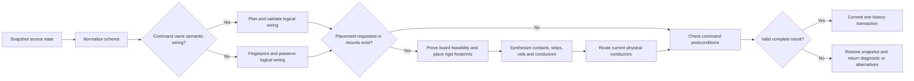

# Elera Automation Engine Contract

Status: normative design contract  
Contract version: 1.1
Last reconciled with the implementation: 2026-09-01

This document defines the rules and ownership boundaries for Auto Wire, Auto Layout, Clean and Validation. It supersedes descriptive comments inside individual engine files when those comments conflict with this contract.

For an operational flowchart of every engine and a worked diagnosis of non-orthodox breadboard routing, see [SELF_HEALING_ENGINE.md](SELF_HEALING_ENGINE.md).

"Self-healing" does not mean that Elera may silently redesign a user's circuit. It means that every automated command follows a guarded loop:

1. Snapshot the last valid source state.
2. Normalize input and plan without mutation.
3. Check electrical, physical and command-specific postconditions.
4. Commit one coherent result.
5. If planning or verification fails, restore the snapshot and return an actionable diagnostic.

The contract remains healthy through stable rule IDs, regression evidence, a machine-checked traceability registry and an explicit implementation-drift ledger.

## Authority and priorities

When two objectives conflict, use this order:

1. Electrical safety and correct net identity.
2. Legal physical connectivity and exclusive hole occupancy.
3. Locked user intent and existing valid manual placements.
4. Complete realization; never hide a disconnected endpoint.
5. Readability: direct paths, rail buses, fanout and low visual crossing count.
6. Short total conductor length and few bends.
7. Compact and visually balanced placement.

A lower priority must never be traded for a higher-priority violation. For example, a shorter route may not cross a component body, and a compact pushbutton placement may not short both sides of the switch.

## State layers and ownership

| Layer | Authoritative data | Persisted | May be changed by |
| --- | --- | --- | --- |
| Logical circuit | Components, component pins, logical connections/nets, generated-helper provenance | Yes | Manual editing, validated AI `connect_pins`, Auto Wire, the Auto Wire stage of user-facing Auto Layout |
| User constraints | Locks and explicitly retained board mount constraints | Yes | Manual placement and lock controls |
| Physical realization | Board resources, rigid placements, contacts, terminal/rail assignments and conductors in `physicalPlan` | Derived; only explicit constraints persist | Auto Layout, or Auto Wire rebuilding around unchanged mounts |
| Route geometry | Conductor waypoints and orthogonal mode | No | Clean, route-only operations, and the routing stage of user-facing Auto Layout |
| View state | Pan, zoom, selection, hover and tooltips | No | Editor UI only |

The DOM, SVG bounding boxes and registered Wokwi pin elements are rendering adapters. They are not the source of logical connectivity or breadboard topology. Pure planners in `src/core` must be runnable without a browser.

Logical endpoints must never be rewritten into breadboard-hole endpoints. A physical contact maps a logical endpoint to a hole; a physical conductor joins contacts or connectors. Internal terminal-strip and rail connectivity comes from the board model and is not represented by fake visible wires.

## Command mutation contract

| Command | Logical connections | Helper components | Component/board position | Hole and rail assignment | Waypoints | Failure behavior |
| --- | --- | --- | --- | --- | --- | --- |
| Auto Wire | May assign or replace in-scope generated connections | May insert deterministic required helpers | Must not move anything | Must preserve every existing valid mount; may rebuild conductors around those fixed mounts | Invalidated when connectivity changes; Clean owns optimization | No destructive partial rewrite of an endpoint that could not be reassigned |
| Auto Layout (UI composition) | Runs Auto Wire as its logical prerequisite | May insert deterministic required helpers | May move unlocked items and board resources | May repack unlocked placements; locked placements are hard constraints | Routes the completed scene | No mutation when capacity or legality cannot be proven; offer verified alternatives |
| Arrange Components | Must not change | Must not change | May move unlocked items and board resources | May repack unlocked placements; locked placements are hard constraints | Must preserve persisted route intent; derived display routes may refresh | Preserve the original semantic circuit if placement fails |
| Auto Route / Clean | Must not change | Must not change | Must not change | Must not change | May replace only route geometry | Keep the previous path for an unresolved conductor and report it |
| Validation | Read-only | Read-only | Read-only | Read-only | Read-only | Always return structured findings; never repair by mutation |

There is exactly one placement owner per command. Auto Wire cannot run a second layout algorithm. Clean cannot improve placement. Validation cannot fix the issue it reports.

## Guarded command pipeline

The service layer adapts editor state into planner input and commits output. It must not contain an independent competing planner. A user-confirmed board addition or replacement reruns the same pipeline from the original snapshot.

## Core invariants

- **CORE-01 — Logical/physical separation.** Logical nets contain component-pin endpoints only. Breadboard holes exist only in physical contacts and conductors.
- **CORE-02 — Determinism.** Equal normalized input and equal constraints produce equal pin assignments, placements, conductor identities, colors and routes. Ties use stable IDs, pin names and hole IDs.
- **CORE-03 — Atomicity.** Auto Wire, validated pin connections, and Auto Layout commit a coherent result or preserve the last valid state. One toolbar command produces one undo step.
- **CORE-04 — Rigid geometry.** A footprint may translate and use an allowed rotation with one uniform 2.54 mm pitch-derived scale. It may never stretch pins independently.
- **CORE-05 — Constraint preservation.** Locked items never move. Auto Wire treats all existing valid breadboard mounts as fixed even when they are not persisted as user locks.
- **CORE-06 — Bounded planning.** Planning must terminate without waiting indefinitely for DOM registration. Unsupported or unresolved parts produce diagnostics instead of blocking readiness.
- **CORE-07 — Stable diagnostics.** Engine diagnostics use stable codes and structured context. The UI translates them into student-facing messages.
- **CORE-08 — Authoritative pin capabilities.** Controller capability queries, exact-pin connection validation, physical footprints and Auto Wire derive controller pins from the component definition's `autoWirePins` inventory. AI-specific duplicate pin catalogs are forbidden.

## Auto Wire rules

- **AW-01 — Scope.** Rewire only eligible, requested components. Preserve unrelated manual logical connections.
- **AW-02 — Compatible pin assignment.** Respect metadata roles: VCC to a compatible supply, GND to ground, I2C SDA/SCL to A4/A5 on Uno, PWM to PWM, analog to analog, and other signals to eligible digital pins.
- **AW-03 — Nearest compatible header.** Among free compatible Arduino pins, choose the physically nearest pin to the component endpoint. Apply stable pin-name ordering when distances tie. Honor component `avoidPins` metadata.
- **AW-04 — Shared supply nets.** VCC and GND are shared logical domains, not one independent source net per component. Physical rail fanout is decided later.
- **AW-05 — Generated helpers.** Required helpers such as LED current-limiting resistors are ordinary logical components with deterministic IDs and provenance. Repeating Auto Wire replaces, rather than duplicates, helpers owned by the same rule.
- **AW-06 — Existing breadboard realization.** If mounted parts exist, rebuild the physical plan using every current mount, rotation and anchor hole as a hard constraint. Failure leaves the existing realization untouched.
- **AW-07 — Direct connectivity.** Do not introduce a breadboard merely to connect endpoints that are clearer and electrically valid as a direct connection.
- **AW-08 — Net colors.** Ground is black, power is red, conflicts are red-alert, and signal nets receive deterministic distinct palette colors. Every conductor in one logical net shares its net color.
- **AW-09 — Controller ownership.** With multiple compatible controllers, each auto-wired component has one stable controller owner. Preserve an existing valid owner; otherwise choose deterministically by whole-component role feasibility, remaining capacity, physical distance and stable controller ID. Pin use, I2C reservations and supply domains are independent per controller. Never join controller supply domains automatically.

Pin exhaustion is not permission to delete a previously valid connection. It returns `NO_COMPATIBLE_ARDUINO_PIN` with the component, pin and required role.

## Auto Layout and breadboard rules

### Placement ownership

- **AL-01 — One layout branch.** A circuit with a physical breadboard plan uses the breadboard-scene layout. A direct circuit uses the original Arduino top/bottom-row layout. The branches never run sequentially over the same scene.
- **AL-02 — Header affinity.** Place the breadboard above or below the Uno according to the exit direction of the signal headers actually used. Align using signal conductors, not power/ground feeders.
- **AL-03 — Direct scene.** In a non-breadboard circuit, classify components by their primary Arduino connection, keep series helpers with their owner, distribute rows without overlap and retain locked positions.
- **AL-04 — Mounted order.** Place locked parts first, then the most constrained/largest-pin-count footprints, then use signal-header affinity and stable component IDs as tie breakers.
- **AL-05 — Multiple-controller clusters.** Auto Layout builds one cluster per controller ownership group, lays out each cluster using its own direct or breadboard branch, then packs clusters without overlap. Explicit cross-controller nets are preserved and routed between clusters; they do not merge ownership or supply domains.
- **AL-06 — Physical-stage topology preservation.** The independently callable Arrange Components stage changes placement only. It never invokes Auto Wire, creates or removes wires, changes endpoints or pin assignments, inserts helpers, or changes persisted route intent. The user-facing Auto Layout command may compose Auto Wire before this stage.

### Breadboard electrical model

- **BB-01 — Actual topology.** A half board has 300 terminal holes arranged as A-J by 1-30 and 100 rail holes. Each five-hole A-E or F-J column group is internally connected. Each modeled rail segment is a bus.
- **BB-02 — Exclusive holes.** One hole accepts at most one component lead or jumper endpoint. A jumper endpoint cannot share a component-lead hole.
- **BB-03 — Exclusive groups.** One internally connected terminal group belongs to at most one logical net. Assigning two different nets is an accidental short.
- **BB-04 — Internal connectivity is invisible.** Endpoints sharing a valid terminal group need no drawn jumper. Their internal path has zero visual length.
- **BB-05 — Rail distribution.** Use one source feeder per supply net and used rail segment. On an unsplit half board, use one rail bus per net whenever it has capacity; link rails only when split topology, multiple boards or capacity requires it. Allocate unique, nearby holes for local branches. Never branch multiple drawn wires from one rail hole.
- **BB-06 — Direct versus realized nets.** Mountable through-hole endpoints may use terminal strips; shared supply nets may use rails; connections that gain no clarity from the board remain direct.
- **BB-07 — Jumper connectors.** Infer male-male, male-female or female-female jumper ends from both endpoint connector types. Do not infer gender from wire color or net kind.
- **BB-08 — Body clearance.** Jumper segments may not run underneath a mounted component body. The source and destination component bodies are excluded only for their own escape segments.
- **BB-09 — Legal switch placement.** A four-leg pushbutton must use a registered rigid footprint in a legal 90° or 270° trench-straddling orientation. Internally common legs cannot collapse two distinct switch nets into one strip.

### Capacity and objective function

- **CAP-01 — Proof of capacity.** Free-hole counts are diagnostics, not proof. A board fits only if the planner finds a complete legal placement, net-group assignment and conductor realization.
- **CAP-02 — Recovery order.** Try repacking unlocked parts, adding a same-size board, then replacing with the smallest supported larger board. Only alternatives that have already produced a complete plan may be offered.
- **CAP-03 — User authority.** Adding or replacing hardware requires confirmation. Cancelling changes nothing.

After hard constraints pass, placement is compared lexicographically:

1. Fewer physical jumpers by sharing same-net terminal groups.
2. No body overlap and no blocked jumper holes.
3. Preserve current valid positions where possible.
4. Shorter connection distance to the related Arduino signal header.
5. Shorter total local conductor length.
6. Fewer bends and crossings.
7. Stable board, component and hole IDs.

## Clean and routing rules

- **CL-01 — Geometry only.** Clean may alter `waypoints` and orthogonal route mode. It cannot add/delete wires, change endpoints, nets, colors, jumper types, positions, rotations, mount holes or board topology.
- **CL-02 — Pin escape.** A wire leaves a non-breadboard header perpendicular to the header edge far enough to clear its component before turning. Source and destination components are excluded from middle-route obstacles.
- **CL-03 — Fanout.** Adjacent header wires receive distinct lanes before obstacle routing. Clean must not stack multiple segments on the same lane merely because that path is shortest.
- **CL-04 — Obstacle safety.** Middle segments are orthogonal and must avoid inflated component bounds. A path crossing a body is invalid, not merely expensive.
- **CL-05 — Breadboard-local routing.** A conductor whose endpoints are holes on the same board stays inside that board, tries a direct segment first, avoids mounted bodies and then chooses the shortest candidate with the fewest points.
- **CL-06 — Global route cost.** Among valid routes, minimize Manhattan length plus bend cost and a strong near-overlap penalty. Stable net and endpoint order makes the result deterministic.
- **CL-07 — Failure isolation.** Failure to resolve one conductor's pins preserves its previous path, routes other conductors and reports the failed conductor ID.
- **CL-08 — Existing nets only.** Route-only operations consume the current semantic wires and may change route intent/derived paths only. They cannot create, delete, merge, split, or retarget a net.

Routing order is signal, I2C, power, then ground. This lets visually important signal lanes claim simple corridors first while rail-based supply wiring remains local.

## Validation rules

- **VAL-01 — Read-only layers.** Logical checks read source logical wires. Physical checks read contacts, placements and renderable physical conductors. Validation never substitutes one layer for the other or mutates either.
- **VAL-02 — Structured result.** Return `{ errors, warnings, info, all }`. Each finding has a stable `id`, `severity`, actionable `message` and optional `instanceId`, `pinName` and `relatedIds`.
- **VAL-03 — Severity.** Error means electrically unsafe or impossible; warning means likely incorrect or risky; info means optional guidance. Layout aesthetics alone are not electrical errors.
- **VAL-04 — Logical checks.** Detect no board, missing LED resistor, current overload/high current, illegal duplicate signal-pin use, serial-pin conflicts, missing VCC/GND, wrong I2C pins, unconnected components and floating required pins.
- **VAL-05 — Breadboard checks.** Detect missing/useful board guidance, insufficient capacity, unknown holes, occupied holes, placement overlap, incompatible or illegal footprints, disconnected mounted contacts and power-to-ground shorts.
- **VAL-06 — Bus awareness.** Shared protocols and supply domains may legally have multiple endpoints. Duplicate-pin validation distinguishes a bus from accidentally assigning unrelated point-to-point signals to one Arduino pin.
- **VAL-07 — Postcondition gate.** A newly planned physical result cannot be committed with a new error-level short, overlap, illegal footprint, invalid hole or disconnected required endpoint.
- **VAL-08 — Exact controller-pin compatibility.** An exact-pin mutation derives the ordinary endpoint's required role from component metadata, checks the selected controller pin's capabilities/constraints, rejects hard incompatibilities transactionally, and returns non-fatal pin concerns as warnings.

Current validation finding IDs are:

`no-board`, `led-no-resistor`, `current-overload`, `current-high`, `duplicate-pin`, `servo-serial`, `missing-vcc`, `missing-gnd`, `i2c-wrong-sda`, `i2c-wrong-scl`, `unconnected`, `floating-pin`, `breadboard-required`, `breadboard-useful`, `breadboard-capacity`, `breadboard-invalid-hole`, `breadboard-occupied-hole`, `breadboard-invalid-placement`, `breadboard-placement-overlap`, `breadboard-footprint`, `breadboard-footprint-short`, `breadboard-disconnected-net`, and `breadboard-short`.

## Manual interaction recovery

- **INT-01 — Click is read-only.** Selection, hover and pin registration cannot move or replan a component.
- **INT-02 — Drag threshold.** A pointer action becomes a drag only after the editor threshold is crossed.
- **INT-03 — Atomic mounted edit.** Before dragging or rotating a mounted part, snapshot instances, logical wires and the physical plan. Rebuild with all mounts constrained. On failure, restore the entire snapshot.
- **INT-04 — Board movement.** Moving a breadboard carries its mounted parts and physical conductor geometry as one scene operation.
- **INT-05 — Snap result.** A successful manual drop aligns the complete rigid footprint, not merely the closest visible pin.

## Recovery and feedback matrix

| Condition | Engine response | User-facing action |
| --- | --- | --- |
| No Arduino | Preserve state; `NO_ARDUINO` | Add an Arduino Uno |
| No compatible header pin | Preserve the affected previous connection; `NO_COMPATIBLE_ARDUINO_PIN` | Free or manually choose a compatible pin |
| Required breadboard missing | Return `needs-resource-action` with a proven board plan | Confirm Add breadboard or cancel |
| Current board cannot fit | Return `INSUFFICIENT_BOARD_CAPACITY` and only proven alternatives | Add board, replace with larger board, review locks, or cancel |
| Locked footprint is illegal | Preserve state and identify the component/anchor | Unlock, rotate or move the component |
| Placement would short two nets | Preserve state and identify both nets/group | Move or rotate the part |
| Router cannot resolve a pin | Keep that conductor's previous path and route the rest | Identify the component/pin needing registration or metadata |
| Post-validation introduces an error | Roll back the command | Show the blocking finding and affected items |

## Traceability registry

The rows between the markers are parsed by `test/engine-contract.test.js`. Rule IDs must be unique and every referenced implementation and regression file must exist.

<!-- engine-contract:start -->
| Rule | Requirement | Implementation | Regression evidence |
| --- | --- | --- | --- |
| `CORE-01` | Logical and physical connectivity remain separate | `src/core/circuit-model.js`, `src/core/editor-project-adapter.js` | `test/editor-project-adapter.test.js`, `test/project-schema.test.js` |
| `CORE-02` | Planning and net colors are deterministic | `src/core/auto-wire-planner.js`, `src/services/auto-wire-engine.js` | `test/auto-wire-planner.test.js`, `test/rebuild-integration.test.js` |
| `CORE-03` | Planning is atomic and one command is one history action | `src/services/auto-wire-engine.js`, `src/store.js` | `test/rebuild-integration.test.js`, `test/breadboard-planner.test.js` |
| `CORE-04` | Footprints use rigid 2.54 mm geometry | `src/core/component-geometry.js` | `test/component-geometry.test.js`, `test/breadboard-model.test.js` |
| `CORE-06` | Planning does not wait for DOM registration | `src/circuit-app.js`, `src/core/component-geometry.js` | `test/component-geometry.test.js`, `test/rebuild-integration.test.js` |
| `CORE-08` | Controller pin capabilities have one component-metadata source | `src/component-library.js`, `src/core/pin-capabilities.js` | `test/ai-agent.test.js` |
| `AW-02` | Pin roles select compatible active-MCU headers | `src/core/auto-wire-planner.js` | `test/auto-wire-planner.test.js` |
| `AW-03` | Signals choose the nearest compatible header | `src/core/auto-wire-planner.js` | `test/auto-wire-planner.test.js` |
| `AW-04` | Supply domains are shared | `src/core/auto-wire-planner.js`, `src/core/circuit-model.js` | `test/auto-wire-planner.test.js`, `test/circuit-model.test.js` |
| `AW-05` | Generated resistors are deterministic and idempotent | `src/core/auto-wire-planner.js` | `test/auto-wire-planner.test.js` |
| `AW-06` | Auto Wire preserves mounted footprints | `src/services/auto-wire-engine.js` | `test/rebuild-integration.test.js` |
| `AW-08` | Net colors are stable and signals remain distinguishable | `src/services/auto-wire-engine.js` | `test/rebuild-integration.test.js` |
| `AW-09` | Components keep stable controller ownership and independent controller budgets | `src/core/auto-wire-planner.js`, `src/physical/automation.js` | `test/auto-wire-planner.test.js`, `test/physical-automation.test.js` |
| `AL-01` | Direct and breadboard scenes use separate layout branches | `src/services/auto-wire-engine.js` | `test/breadboard-layout.test.js` |
| `AL-02` | Breadboard placement follows active header affinity | `src/services/auto-wire-engine.js` | `test/breadboard-layout.test.js` |
| `AL-04` | Constrained footprints are placed before flexible ones | `src/core/breadboard-planner.js` | `test/breadboard-planner.test.js` |
| `AL-05` | Multiple controllers use independently laid-out non-overlapping clusters | `src/physical/automation.js` | `test/physical-automation.test.js` |
| `AL-06` | The physical-only arrangement stage preserves semantic wires and route intent | `src/physical/automation.js`, `src/ai/tools.js` | `test/physical-automation.test.js`, `test/ai-agent.test.js` |
| `BB-01` | Board registry models terminal and rail topology | `src/core/board-registry.js`, `src/breadboard-model.js` | `test/board-registry.test.js`, `test/breadboard-model.test.js` |
| `BB-02` | Leads and jumper endpoints have exclusive holes | `src/core/breadboard-planner.js`, `src/services/breadboard-service.js` | `test/breadboard-layout.test.js`, `test/breadboard-planner.test.js` |
| `BB-04` | Same-strip connectivity suppresses drawn jumpers | `src/core/breadboard-planner.js` | `test/breadboard-planner.test.js` |
| `BB-05` | Rails use one feeder and unique local branches | `src/core/breadboard-planner.js` | `test/breadboard-layout.test.js`, `test/breadboard-planner.test.js` |
| `BB-07` | Jumper gender follows connector types | `src/breadboard-model.js` | `test/breadboard-model.test.js` |
| `BB-09` | Pushbuttons use legal trench-straddling footprints | `src/core/component-geometry.js` | `test/component-geometry.test.js`, `test/breadboard-layout.test.js` |
| `CAP-01` | Capacity requires a complete legal placement | `src/core/breadboard-planner.js` | `test/breadboard-planner.test.js` |
| `CAP-02` | Capacity alternatives are proven before offering them | `src/core/breadboard-planner.js` | `test/breadboard-planner.test.js`, `test/rebuild-integration.test.js` |
| `CL-02` | Non-board pins escape before turning | `src/services/routing-engine.js` | `test/breadboard-layout.test.js` |
| `CL-03` | Header wires fan into distinct lanes | `src/services/routing-engine.js` | `test/breadboard-layout.test.js` |
| `CL-05` | Same-board jumpers use short body-clear local routes | `src/services/routing-engine.js` | `test/breadboard-layout.test.js` |
| `CL-08` | Route-only operations preserve existing semantic nets | `src/ai/tools.js`, `src/physical/routing.js` | `test/ai-agent.test.js`, `test/physical-interaction.test.js` |
| `VAL-01` | Validation distinguishes logical and physical views | `src/services/validation-engine.js` | `test/project-schema.test.js`, `test/breadboard-layout.test.js` |
| `VAL-05` | Breadboard legality produces validation findings | `src/services/validation-engine.js` | `test/breadboard-layout.test.js`, `test/breadboard-planner.test.js` |
| `VAL-08` | Exact controller-pin mutations enforce metadata capabilities transactionally | `src/core/pin-capabilities.js`, `src/ai/tools.js` | `test/ai-agent.test.js` |
| `INT-01` | Selection and registration cannot move parts | `src/components/placed-component.js`, `src/store.js` | `test/breadboard-layout.test.js` |
| `INT-03` | Mounted edits rebuild atomically or roll back | `src/components/placed-component.js`, `src/services/breadboard-service.js` | `test/rebuild-integration.test.js`, `test/breadboard-layout.test.js` |
<!-- engine-contract:end -->

## Known contract drift

These are not accepted exceptions. They are visible work items. Removing a row requires a regression test proving the corresponding rule.

| Gap | Current drift | Contract to satisfy |
| --- | --- | --- |
| `GAP-03` | Auto Wire replaces connectivity with empty waypoints and does not invoke Clean from the toolbar. | The command contract must deliberately choose either immediate baseline routing or an explicit route-dirty state; it must not be accidental. |
| `GAP-04` | Duplicate Arduino-pin validation does not yet distinguish legal shared I2C bus endpoints from unrelated signals. | `VAL-06`: recognize bus-capable shared nets. |
| `GAP-05` | Some full-size breadboard validation paths use half-board hole/group lookup helpers. | `VAL-05`: resolve holes and groups through each instance's registered board definition. |
| `GAP-06` | Validation issue codes do not yet each have a focused fixture. | Every `VAL-*` behavior and public finding ID needs direct regression evidence. |
| `GAP-07` | Browser acceptance is manual; pointer, zoom and final rendered geometry are not in automated CI. | Add browser fixtures for the primary mixed circuit and interaction rollback. |

## Change protocol

Every engine change must follow this sequence:

1. Name the affected rule IDs in the change description. Add a new ID if no rule covers the behavior.
2. Add the smallest failing pure-planner fixture first. For command boundaries, also add a store-level integration fixture.
3. Fingerprint state layers before and after the command. Assert that forbidden columns in the command mutation table are unchanged.
4. Implement in the owning layer: pure decision in `src/core`, editor adaptation/commit in `src/services`, history in `src/store.js`, presentation in components.
5. Add structured diagnostics for any new failure mode. Do not parse user-facing strings in engine logic.
6. Update the traceability registry. The next `npm run dev`, `npm test` or `npm run build` synchronizes the generated engine-flow document. If behavior is temporarily incomplete, add a numbered drift row instead of weakening the rule.
7. Run `npm test`, `npm run build` and `git diff --check`. Run the primary browser fixture for changes affecting geometry or interaction.

A rule may be changed only with an explicit design decision, updated tests and a contract-version note. A rule must not be deleted merely to make a regression pass.

## Primary acceptance fixture

The canonical mixed fixture is Arduino Uno plus LED and generated resistor, pushbutton, DHT22 and another powered output/input where useful. It passes only when:

- all logical endpoints belong to the intended nets;
- required helpers appear exactly once;
- mounted pins align with actual holes at one uniform scale;
- the pushbutton legally straddles the trench;
- no hole, terminal group or component body is illegally shared;
- each used supply rail has one feeder and unique branch holes;
- direct connections remain direct where the board adds no value;
- header fanout is distinct and jumpers are short, orthogonal and body-clear;
- Auto Wire moves nothing;
- Auto Layout preserves locks and commits one complete scene;
- Clean changes route geometry only;
- Validation reports no false power/ground short or disconnected required net;
- insufficient capacity returns verified add/replace options without partial mutation;
- repeating any command is deterministic and does not duplicate helpers.
- two different controllers retain independent component ownership, pin budgets, supply domains and non-overlapping layout clusters.
