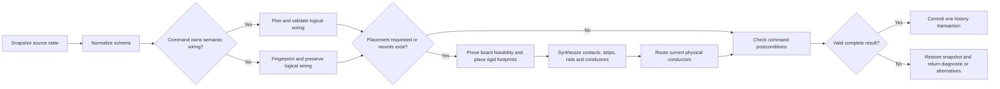
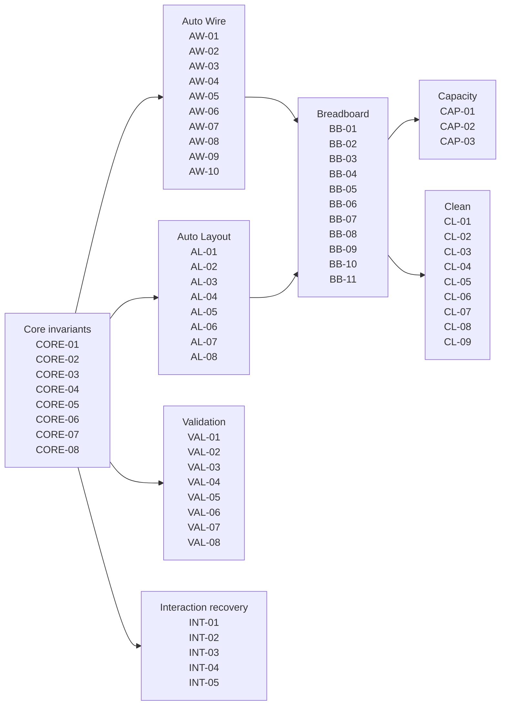
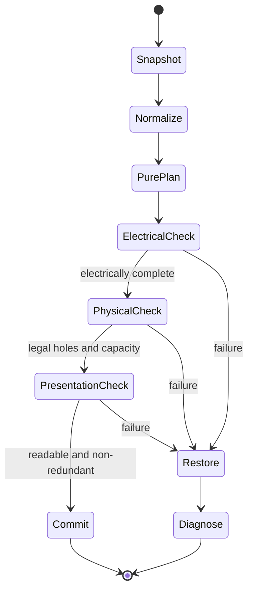
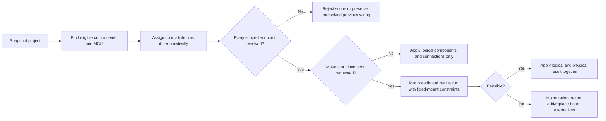
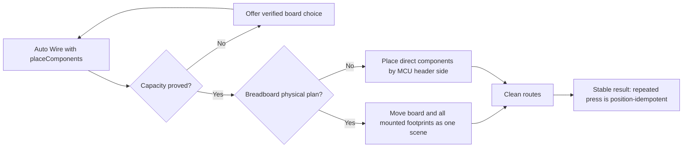
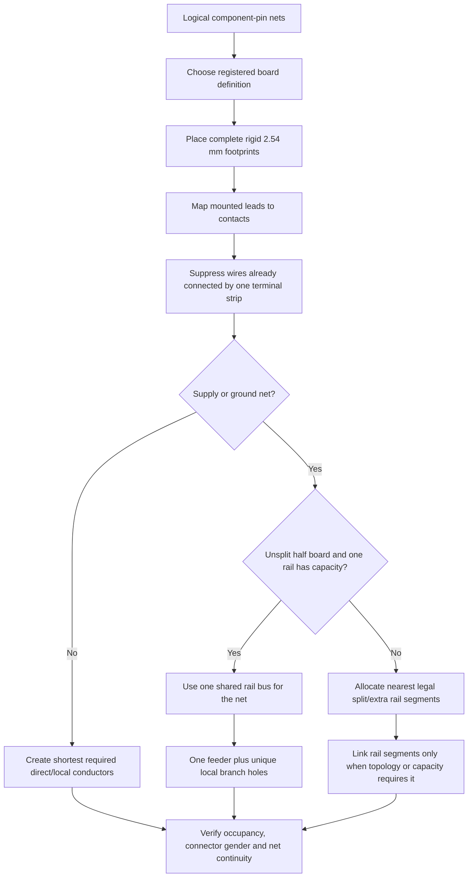
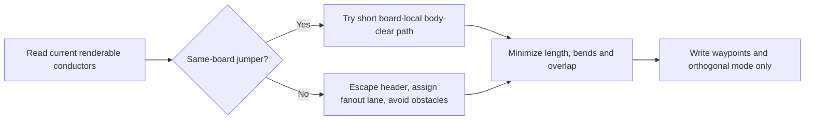
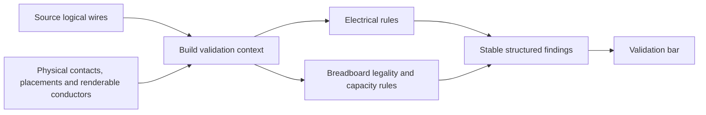
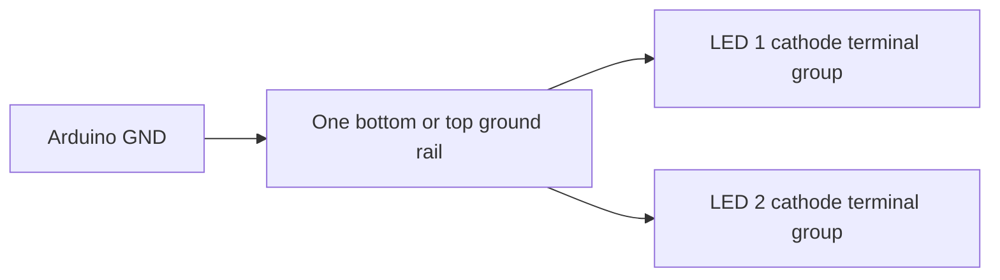

# Elera Self-Healing Engine Flow

Status: operational map  
Last reconciled with implementation: 2026-10-05\
Normative authority: [ENGINE_CONTRACT.md](ENGINE_CONTRACT.md)

This document answers two questions: which engine owns each decision, and how an automated command recovers when it cannot prove a safe result. If this map and the engine contract disagree, the contract wins.

"Self-healing" has two precise meanings here. Engine commands use bounded recovery rather than silently redesigning a user's circuit, and this document synchronizes its pipeline, rule ownership, rule text and traceability from the normative contract. `npm run dev`, `npm test` and `npm run build` refresh the generated block before doing their normal work.

The hand-written flowcharts after the generated block were drawn for the legacy schema-v2 engine. The running schema-4 engine in `src/physical/` follows the same ownership boundaries, but it does not yet offer capacity alternatives or locked placements, and its validation is narrower (`GAP-09` in the contract).

<!-- engine-doc-sync:start -->
> Generated from `ENGINE_CONTRACT.md` by `npm run docs:sync`. Do not edit this block.
> Contract fingerprint: `42d9eb14eeec`

## Contract-synchronized command pipeline

## Contract-synchronized rule ownership

## Contract-synchronized rule catalog

### Core invariants

- **CORE-01 — Logical/physical separation.** Logical nets contain component-pin endpoints only. Breadboard holes exist only in physical contacts and conductors.
- **CORE-02 — Determinism.** Equal normalized input and equal constraints produce equal pin assignments, placements, conductor identities, colors and routes. Ties use stable IDs, pin names and hole IDs.
- **CORE-03 — Atomicity.** Auto Wire, validated pin connections, and Auto Layout commit a coherent result or preserve the last valid state. One toolbar command produces one undo step.
- **CORE-04 — Rigid geometry.** A footprint may translate and use an allowed rotation with one uniform 2.54 mm pitch-derived scale. It may never stretch pins independently.
- **CORE-05 — Constraint preservation.** Locked items never move. Auto Wire treats all existing valid breadboard mounts as fixed even when they are not persisted as user locks.
- **CORE-06 — Bounded planning.** Planning must terminate without waiting indefinitely for DOM registration. Unsupported or unresolved parts produce diagnostics instead of blocking readiness.
- **CORE-07 — Stable diagnostics.** Engine diagnostics use stable codes and structured context. The UI translates them into student-facing messages.
- **CORE-08 — Authoritative pin capabilities.** Controller capability queries, exact-pin connection validation, physical footprints and Auto Wire derive controller pins from the component definition's `autoWirePins` inventory. AI-specific duplicate pin catalogs are forbidden.

### Auto Wire

- **AW-01 — Scope.** Rewire only eligible, requested components. Preserve unrelated manual logical connections.
- **AW-02 — Compatible pin assignment.** Respect metadata roles: VCC to a compatible supply, GND to ground, I2C SDA/SCL to A4/A5 on Uno, PWM to PWM, analog to analog, and other signals to eligible digital pins.
- **AW-03 — Nearest compatible header.** Among free compatible Arduino pins, choose the physically nearest pin to the component endpoint. Apply stable pin-name ordering when distances tie. Honor component `avoidPins` metadata.
- **AW-04 — Shared supply nets.** VCC and GND are shared logical domains, not one independent source net per component. Physical rail fanout is decided later.
- **AW-05 — Generated helpers.** When the safety preference is enabled, LED current-limiting resistors are ordinary logical components with deterministic IDs, color- and voltage-aware values, and provenance. Repeating Auto Wire replaces rather than duplicates them. When disabled, Auto Wire may connect the LED directly but validation must warn about the missing resistor.
- **AW-06 — Existing breadboard realization.** If mounted parts exist, rebuild the physical plan using every current mount, rotation and anchor hole as a hard constraint. Failure leaves the existing realization untouched.
- **AW-07 — Direct connectivity.** Do not introduce a breadboard merely to connect endpoints that are clearer and electrically valid as a direct connection.
- **AW-08 — Net colors.** Ground is black, power is red, conflicts are red-alert, and signal nets receive deterministic distinct palette colors. Every conductor in one logical net shares its net color.
- **AW-09 — Controller ownership.** With multiple compatible controllers, each auto-wired component has one stable controller owner. Preserve an existing valid owner; otherwise choose deterministically by whole-component role feasibility, remaining capacity, physical distance and stable controller ID. Pin use, I2C reservations and supply domains are independent per controller. Never join controller supply domains automatically.
- **AW-10 — Breadboard-aware realization.** Auto Wire stores component-pin netlist intent separately from physical conductors. For mounted pins it collapses fixed breadboard groups, generates only the minimum missing jumpers, reserves a distinct free socket per jumper end, and leaves all component placements unchanged. A present but unused breadboard has no effect on direct wiring.

### Auto Layout

- **AL-01 — One layout branch.** A circuit with a physical breadboard plan uses the breadboard-scene layout. A direct circuit uses the original Arduino top/bottom-row layout. The branches never run sequentially over the same scene.
- **AL-02 — Header affinity.** Place the breadboard above or below the Uno according to the exit direction of the signal headers actually used. Align using signal conductors, not power/ground feeders.
- **AL-03 — Direct scene.** In a non-breadboard circuit, classify components by their primary Arduino connection, keep series helpers with their owner, distribute rows without overlap and retain locked positions.
- **AL-04 — Mounted order.** Place locked parts first, then the most constrained/largest-pin-count footprints, then use signal-header affinity and stable component IDs as tie breakers.
- **AL-05 — Multiple-controller clusters.** Auto Layout builds one cluster per controller ownership group, lays out each cluster using its own direct or breadboard branch, then packs clusters without overlap. Explicit cross-controller nets are preserved and routed between clusters; they do not merge ownership or supply domains.
- **AL-06 — Physical-stage topology preservation.** The independently callable Arrange Components stage changes placement only. It never invokes Auto Wire, creates or removes wires, changes endpoints or pin assignments, inserts helpers, or changes persisted route intent. The user-facing Auto Layout command may compose Auto Wire before this stage.
- **AL-07 — Board clearance.** In a breadboard scene, every free/off-board component stays outside the breadboard body and clearance margin. Layout may move the board cluster or the free component, but it never mounts that component implicitly.
- **AL-08 — Generated-helper mounting.** In the combined Auto Layout pipeline only, a helper generated by that same Auto Wire plan may be mounted beside an already-mounted owner when every pin has a legal free socket and body keepouts remain clear. Auto Layout prefers the compact five-hole/four-pitch horizontal resistor, tries other horizontal lead spans next, and uses the upright package only as a legal capacity fallback. Series helpers are oriented as a monotonic incoming jumper → resistor → LED → outgoing jumper chain, leaving jumper groups outside the two components instead of folding the resistor back across the LED. User-placed components are never mounted or have their package changed implicitly. Physical realization runs again after the helper mount so fixed breadboard copper suppresses redundant jumpers.

### Breadboard

- **BB-01 — Actual topology.** A half board has 300 terminal holes arranged as A-J by 1-30 and 100 rail holes. Each five-hole A-E or F-J column group is internally connected. Each modeled rail segment is a bus.
- **BB-02 — Exclusive holes.** One hole accepts at most one component lead or jumper endpoint. A jumper endpoint cannot share a component-lead hole.
- **BB-03 — Exclusive groups.** One internally connected terminal group belongs to at most one logical net. Assigning two different nets is an accidental short.
- **BB-04 — Internal connectivity is invisible.** Endpoints sharing a valid terminal group need no drawn jumper. Their internal path has zero visual length.
- **BB-05 — Rail distribution.** Use one source feeder per supply net and used rail segment. On an unsplit half board, use one rail bus per net whenever it has capacity; link rails only when split topology, multiple boards or capacity requires it. Allocate unique, nearby holes for local branches. Never branch multiple drawn wires from one rail hole.
- **BB-06 — Direct versus realized nets.** Mountable through-hole endpoints may use terminal strips; shared supply nets may use rails; connections that gain no clarity from the board remain direct.
- **BB-07 — Jumper connectors.** Infer male-male, male-female or female-female jumper ends from both endpoint connector types. Do not infer gender from wire color or net kind.
- **BB-08 — Body clearance.** Jumper segments may not run underneath a mounted component body. The source and destination component bodies are excluded only for their own escape segments.
- **BB-09 — Legal switch placement.** A four-leg pushbutton must use a registered rigid footprint in a legal 90° or 270° trench-straddling orientation. Internally common legs cannot collapse two distinct switch nets into one strip.
- **BB-10 — Explicit socket state.** Every stable socket has a derived `FREE`, `COMPONENT_PIN`, or `WIRE_ENDPOINT` state. Component-body keepouts and routed paths are separate geometry and never masquerade as socket occupancy.
- **BB-11 — Resistor variants.** One resistor electrical type has three presentations: the unchanged original Wokwi axial resistor for free-space/direct circuits, a compact horizontal breadboard package occupying exactly five hole positions (four pitch intervals), and an upright breadboard package. Horizontal packages may use other legal lead spans without scaling the body. Changing the physical package never changes pin identity, resistance, or circuit intent.

### Capacity

- **CAP-01 — Proof of capacity.** Free-hole counts are diagnostics, not proof. A board fits only if the planner finds a complete legal placement, net-group assignment and conductor realization.
- **CAP-02 — Recovery order.** Try repacking unlocked parts, adding a same-size board, then replacing with the smallest supported larger board. Only alternatives that have already produced a complete plan may be offered.
- **CAP-03 — User authority.** Adding or replacing hardware requires confirmation. Cancelling changes nothing.

### Clean

- **CL-01 — Geometry only.** Clean may alter `waypoints` and orthogonal route mode. It cannot add/delete wires, change endpoints, nets, colors, jumper types, positions, rotations, mount holes or board topology.
- **CL-02 — Pin escape.** A wire leaves a non-breadboard header perpendicular to the header edge far enough to clear its component before turning. Source and destination components are excluded from middle-route obstacles.
- **CL-03 — Fanout.** Adjacent header wires receive distinct lanes before obstacle routing. Clean must not stack multiple segments on the same lane merely because that path is shortest.
- **CL-04 — Obstacle safety.** Middle segments are orthogonal and must avoid inflated component bounds. A path crossing a body is invalid, not merely expensive.
- **CL-05 — Breadboard-local routing.** A conductor whose endpoints are holes on the same board stays inside that board, tries a direct segment first, avoids mounted bodies and then chooses the shortest candidate with the fewest points.
- **CL-06 — Global route cost.** Among valid routes, minimize Manhattan length plus bend cost and a strong near-overlap penalty. Stable net and endpoint order makes the result deterministic.
- **CL-07 — Failure isolation.** Failure to resolve one conductor's pins preserves its previous path, routes other conductors and reports the failed conductor ID.
- **CL-08 — Existing nets only.** Route-only operations consume the current semantic wires and may change route intent/derived paths only. They cannot create, delete, merge, split, or retarget a net.
- **CL-09 — Surface keepout.** Automatic routes treat a breadboard body as a hard obstacle unless the wire has a physical endpoint on that breadboard. Merely having a breadboard in the scene never permits unrelated direct wires to cross it.

### Validation

- **VAL-01 — Read-only layers.** Logical checks read source logical wires. Physical checks read contacts, placements and renderable physical conductors. Validation never substitutes one layer for the other or mutates either.
- **VAL-02 — Structured result.** Return `{ errors, warnings, info, all }`. Each finding has a stable `id`, `severity`, actionable `message` and optional `instanceId`, `pinName` and `relatedIds`.
- **VAL-03 — Severity.** Error means electrically unsafe or impossible; warning means likely incorrect or risky; info means optional guidance. Layout aesthetics alone are not electrical errors.
- **VAL-04 — Logical checks.** Detect no board, missing LED resistor, current overload/high current, illegal duplicate signal-pin use, serial-pin conflicts, missing VCC/GND, wrong I2C pins, unconnected components and floating required pins.
- **VAL-05 — Breadboard checks.** Detect missing/useful board guidance, insufficient capacity, unknown holes, occupied holes, placement overlap, incompatible or illegal footprints, disconnected mounted contacts and power-to-ground shorts.
- **VAL-06 — Bus awareness.** Shared protocols and supply domains may legally have multiple endpoints. Duplicate-pin validation distinguishes a bus from accidentally assigning unrelated point-to-point signals to one Arduino pin.
- **VAL-07 — Postcondition gate.** A newly planned physical result cannot be committed with a new error-level short, overlap, illegal footprint, invalid hole or disconnected required endpoint.
- **VAL-08 — Exact controller-pin compatibility.** An exact-pin mutation derives the ordinary endpoint's required role from component metadata, checks the selected controller pin's capabilities/constraints, rejects hard incompatibilities transactionally, and returns non-fatal pin concerns as warnings.

### Interaction recovery

- **INT-01 — Click is read-only.** Selection, hover and pin registration cannot move or replan a component.
- **INT-02 — Drag threshold.** A pointer action becomes a drag only after the editor threshold is crossed.
- **INT-03 — Atomic mounted edit.** Before dragging or rotating a mounted part, snapshot instances, logical wires and the physical plan. Rebuild with all mounts constrained. On failure, restore the entire snapshot.
- **INT-04 — Board movement.** Moving a breadboard carries its mounted parts and physical conductor geometry as one scene operation.
- **INT-05 — Snap result.** A successful manual drop aligns the complete rigid footprint, not merely the closest visible pin.

## Contract-synchronized traceability registry

| Rule | Requirement | Implementation | Regression evidence |
| --- | --- | --- | --- |
| `CORE-01` | Logical and physical connectivity remain separate | `src/core/circuit-model.js`, `src/core/editor-project-adapter.js` | `test/editor-project-adapter.test.js`, `test/project-schema.test.js` |
| `CORE-02` | Planning and net colors are deterministic | `src/core/auto-wire-planner.js`, `src/services/auto-wire-engine.js` | `test/auto-wire-planner.test.js`, `test/rebuild-integration.test.js` |
| `CORE-03` | Planning is atomic and one command is one history action | `src/services/auto-wire-engine.js`, `src/store.js` | `test/rebuild-integration.test.js`, `test/breadboard-planner.test.js` |
| `CORE-04` | Footprints use rigid 2.54 mm geometry | `src/core/component-geometry.js`, `src/core/part-registry.js` | `test/component-geometry.test.js`, `test/part-registry.test.js` |
| `CORE-06` | Planning does not wait for DOM registration | `src/circuit-app.js`, `src/core/component-geometry.js` | `test/component-geometry.test.js`, `test/rebuild-integration.test.js` |
| `CORE-08` | Controller pin capabilities have one component-metadata source | `src/component-library.js`, `src/core/pin-capabilities.js` | `test/ai-agent.test.js` |
| `AW-02` | Pin roles select compatible active-MCU headers | `src/core/auto-wire-planner.js` | `test/auto-wire-planner.test.js` |
| `AW-03` | Signals choose the nearest compatible header | `src/core/auto-wire-planner.js` | `test/auto-wire-planner.test.js` |
| `AW-04` | Supply domains are shared | `src/core/auto-wire-planner.js`, `src/core/circuit-model.js` | `test/auto-wire-planner.test.js`, `test/circuit-model.test.js` |
| `AW-05` | Generated resistors are deterministic and idempotent | `src/core/auto-wire-planner.js` | `test/auto-wire-planner.test.js` |
| `AW-06` | Auto Wire preserves mounted footprints | `src/services/auto-wire-engine.js` | `test/rebuild-integration.test.js` |
| `AW-08` | Net colors are stable and signals remain distinguishable | `src/services/auto-wire-engine.js` | `test/rebuild-integration.test.js` |
| `AW-09` | Components keep stable controller ownership and independent controller budgets | `src/core/auto-wire-planner.js`, `src/physical/automation.js` | `test/auto-wire-planner.test.js`, `test/physical-automation.test.js` |
| `AW-10` | Mounted nets collapse fixed groups and reserve only required jumper holes | `src/physical/breadboard-auto-wire.js`, `src/physical/automation.js` | `test/physical-core.test.js`, `test/physical-automation.test.js` |
| `AL-01` | Direct and breadboard scenes use separate layout branches | `src/services/auto-wire-engine.js` | `test/breadboard-layout.test.js` |
| `AL-02` | Breadboard placement follows active header affinity | `src/services/auto-wire-engine.js` | `test/breadboard-layout.test.js` |
| `AL-04` | Constrained footprints are placed before flexible ones | `src/core/breadboard-planner.js` | `test/breadboard-planner.test.js` |
| `AL-05` | Multiple controllers use independently laid-out non-overlapping clusters | `src/physical/automation.js` | `test/physical-automation.test.js` |
| `AL-06` | The physical-only arrangement stage preserves semantic wires and route intent | `src/physical/automation.js`, `src/ai/tools.js` | `test/physical-automation.test.js`, `test/ai-agent.test.js` |
| `AL-07` | Free components remain clear of owned breadboard bodies | `src/physical/automation.js` | `test/physical-automation.test.js` |
| `AL-08` | Combined Auto Layout may legally mount only its generated helper and then re-realize connectivity | `src/physical/automation.js`, `src/physical/breadboard-auto-wire.js` | `test/physical-automation.test.js` |
| `BB-01` | One canonical board registry models terminal, trench and rail topology | `src/core/breadboard-topology.js`, `src/core/board-registry.js` | `test/board-registry.test.js`, `test/physical-core.test.js` |
| `BB-02` | Leads and jumper endpoints have exclusive holes | `src/core/breadboard-planner.js`, `src/services/breadboard-service.js` | `test/breadboard-layout.test.js`, `test/breadboard-planner.test.js` |
| `BB-04` | Same-strip connectivity suppresses drawn jumpers | `src/core/breadboard-planner.js` | `test/breadboard-planner.test.js` |
| `BB-05` | Rails use one feeder and unique local branches | `src/core/breadboard-planner.js` | `test/breadboard-layout.test.js`, `test/breadboard-planner.test.js` |
| `BB-07` | Jumper gender follows connector types | `src/breadboard-model.js` | `test/breadboard-model.test.js` |
| `BB-09` | Pushbuttons use legal trench-straddling footprints | `src/core/component-geometry.js` | `test/component-geometry.test.js`, `test/breadboard-layout.test.js` |
| `BB-10` | Stable holes expose exclusive derived occupancy | `src/physical/placement.js`, `src/editor/interaction-controller.js` | `test/physical-core.test.js` |
| `BB-11` | Resistors support compact variable-span and upright physical variants | `src/core/component-geometry.js`, `src/components/circuit-canvas.js` | `test/physical-core.test.js` |
| `CAP-01` | Capacity requires a complete legal placement | `src/core/breadboard-planner.js` | `test/breadboard-planner.test.js` |
| `CAP-02` | Capacity alternatives are proven before offering them | `src/core/breadboard-planner.js` | `test/breadboard-planner.test.js`, `test/rebuild-integration.test.js` |
| `CL-02` | Non-board pins escape before turning | `src/services/routing-engine.js` | `test/breadboard-layout.test.js` |
| `CL-03` | Header wires fan into distinct lanes | `src/services/routing-engine.js` | `test/breadboard-layout.test.js` |
| `CL-05` | Same-board jumpers use short body-clear local routes | `src/services/routing-engine.js` | `test/breadboard-layout.test.js` |
| `CL-08` | Route-only operations preserve existing semantic nets | `src/ai/tools.js`, `src/physical/routing.js` | `test/ai-agent.test.js`, `test/physical-interaction.test.js` |
| `CL-09` | Unrelated automatic wires route around breadboard bodies | `src/physical/routing.js` | `test/physical-core.test.js` |
| `VAL-01` | Validation distinguishes logical and physical views | `src/services/validation-engine.js` | `test/project-schema.test.js`, `test/breadboard-layout.test.js` |
| `VAL-05` | Breadboard legality produces validation findings | `src/services/validation-engine.js` | `test/breadboard-layout.test.js`, `test/breadboard-planner.test.js` |
| `VAL-08` | Exact controller-pin mutations enforce metadata capabilities transactionally | `src/core/pin-capabilities.js`, `src/ai/tools.js` | `test/ai-agent.test.js` |
| `INT-01` | Selection and registration cannot move parts | `src/components/placed-component.js`, `src/store.js` | `test/breadboard-layout.test.js` |
| `INT-03` | Mounted edits rebuild atomically or roll back | `src/components/placed-component.js`, `src/services/breadboard-service.js` | `test/rebuild-integration.test.js`, `test/breadboard-layout.test.js` |
<!-- engine-doc-sync:end -->

## Guarded recovery loop

The checks are ordered deliberately: electrical correctness outranks physical legality, which outranks presentation quality. A visually short route cannot justify a short circuit, an occupied hole, or a broken net. Validation remains a separate observer; command-specific postconditions are the commit gate.

### Auto Wire

Auto Wire must understand the available MCU through metadata (`autoWirePins`, roles and pin metadata). It must not special-case only the Uno, move components, or wait for Wokwi DOM pins to register.

### Auto Layout

Only Auto Layout may repack unlocked positions. Its input is the current logical circuit and constraints, not the previous layout's expanding bounds. That is why repeated presses must converge to identical coordinates instead of pushing parts farther apart.

### Breadboard physical realization

The logical endpoints remain component pins. Breadboard contacts and holes are derived physical data; they must never replace the logical circuit.

### Clean

Clean cannot add a connection, move a part, change a hole, or compensate for a bad physical topology. If the breadboard planner creates an unnecessary rail link, the router can only draw that unnecessary link cleanly.

### Validation

Validation reports; it does not heal by mutation. Repair belongs to an explicit user command so undo history and intent remain trustworthy.

## Orthodox breadboard acceptance rules

A breadboard result is presentation-valid only when all of these hold:

1. Every logical net remains electrically complete and no new short is introduced.
2. Every rigid lead lands on a legal, exclusive hole; no jumper endpoint hides beneath a component body.
3. Leads already joined by a terminal strip do not get decorative wires.
4. A simple half-board supply or ground net uses one continuous rail bus when it has capacity.
5. A rail link exists only for a real split segment, multiple boards, or proven capacity need.
6. Each used rail segment has one feeder, and each branch uses its own nearby rail hole.
7. LED and resistor series pairs remain compact; local breadboard jumpers stay on the board.
8. Ground is black, positive supply is red, and signal colors remain distinct where possible.
9. Among electrically and physically valid options, prefer fewer conductors, shorter length, fewer bends and fewer crossings.

## Worked example: overbuilt ground rails

A reported two-LED scene drew two large black U-shaped ground loops. That was not merely a cosmetic router problem. The old physical planner independently chose the nearest ground rail for each LED group: the upper LED used the top negative rail, the lower LED used the bottom negative rail, and a fourth conductor linked the two rails. Clean then faithfully routed that overbuilt topology as the two large black U-shaped loops.

For this two-LED half-board scene, the expected topology is:

The corrected planner scores all terminal groups and the incoming MCU feeder together. If one half-board rail has enough unblocked holes, it allocates that single bus and emits no top-to-bottom `rail-link`. Full-size boards retain local split-rail behavior because their rail segments are electrically separate.

## Failure and recovery behavior

| Failure | Required behavior | User-visible result |
| --- | --- | --- |
| No compatible MCU pin | Preserve unaffected manual wiring; do not leave a half-rewired scope | Stable pin-assignment diagnostic |
| Footprint or board capacity impossible | Commit nothing | Verified add-board or replace-board choices |
| Locked mount is illegal | Restore the pre-command scene | Identify the component, board and rejected constraint |
| Rail has insufficient free holes | Try another legal segment or fail physical planning | Capacity diagnostic, never stacked endpoints |
| A route cannot resolve its endpoints | Preserve its previous route and continue other conductors | Failed conductor ID |
| Validation detects an existing issue | Do not mutate | Actionable error, warning or info |

Open deviations from these required behaviors are tracked only in [Known contract drift](ENGINE_CONTRACT.md#known-contract-drift), so this map does not normalize bugs as architecture.

## Change checklist

When an engine changes:

1. Name the affected rule in `ENGINE_CONTRACT.md`.
2. Add the failing planner or integration fixture first.
3. Change the smallest owning engine; do not duplicate decisions in UI code.
4. Update `ENGINE_CONTRACT.md`; the synchronized block in this document is generated.
5. Run the full test suite, production build and whitespace check.
