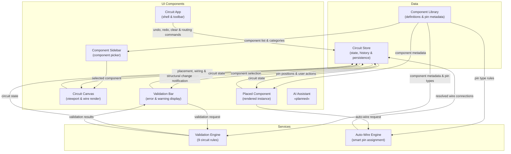

# Diagram 1 — Architecture Diagram (Mermaid flowchart TD)

```mermaid
flowchart TD
    subgraph UI["UI Components"]
        APP["Circuit App\n(shell & toolbar)"]
        CANVAS["Circuit Canvas\n(viewport & wire render)"]
        SIDEBAR["Component Sidebar\n(component picker)"]
        PC["Placed Component\n(rendered instance)"]
        VB["Validation Bar\n(error & warning display)"]
        AI["AI Assistant\n&laquo;planned&raquo;"]
    end

    subgraph SVC["Services"]
        VE["Validation Engine\n(9 circuit rules)"]
        AWE["Auto-Wire Engine\n(smart pin assignment)"]
    end

    subgraph DATA["Data"]
        STORE["Circuit Store\n(state, history & persistence)"]
        CL["Component Library\n(definitions & pin metadata)"]
    end

    CL -- "component list & categories" --> SIDEBAR
    CL -- "component metadata" --> PC
    CL -- "component metadata & pin types" --> VE
    CL -- "pin type rules" --> AWE

    SIDEBAR -- "selected component" --> CANVAS
    CANVAS -- "placement, wiring & selection" --> STORE
    PC -- "pin positions & user actions" --> STORE
    PC -- "auto-wire request" --> AWE
    AWE -- "resolved wire connections" --> STORE

    STORE -- "circuit state" --> CANVAS
    STORE -- "circuit state" --> PC
    STORE -- "structural change notification" --> VB

    VB -- "validation request" --> VE
    VE -- "circuit state" --> STORE
    VE -- "validation results" --> VB
    VB -- "component selection" --> STORE

    APP -- "undo, redo, clear & routing commands" --> STORE
```
