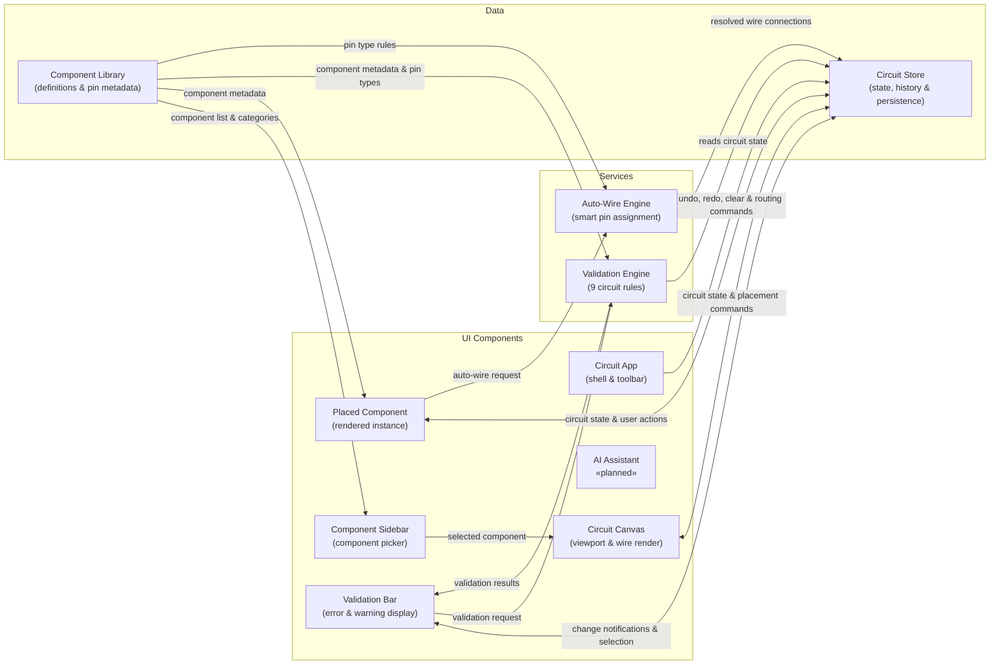

# Diagram 1 — Architecture Diagram (Mermaid flowchart LR)

```mermaid
flowchart LR
    subgraph UI["UI Components"]
        APP["Circuit App\n(shell & toolbar)"]
        SIDEBAR["Component Sidebar\n(component picker)"]
        CANVAS["Circuit Canvas\n(viewport & wire render)"]
        PC["Placed Component\n(rendered instance)"]
        VB["Validation Bar\n(error & warning display)"]
        AI["AI Assistant\n&laquo;planned&raquo;"]
    end

    subgraph SVC["Services"]
        VE["Validation Engine\n(9 circuit rules)"]
        AWE["Auto-Wire Engine\n(smart pin assignment)"]
    end

    subgraph DATA["Data"]
        STORE["Circuit Store\n(state, history & persistence)"]
        CL["Component Library\n(definitions & pin metadata)"]
    end

    CL -->|component list & categories| SIDEBAR
    CL -->|component metadata| PC
    CL -->|component metadata & pin types| VE
    CL -->|pin type rules| AWE

    SIDEBAR -->|selected component| CANVAS
    CANVAS <-->|circuit state & placement commands| STORE
    PC <-->|circuit state & user actions| STORE
    PC -->|auto-wire request| AWE
    AWE -->|resolved wire connections| STORE

    VB <-->|change notifications & selection| STORE
    VB -->|validation request| VE
    VE -->|reads circuit state| STORE
    VE -->|validation results| VB

    APP -->|undo, redo, clear & routing commands| STORE
```
