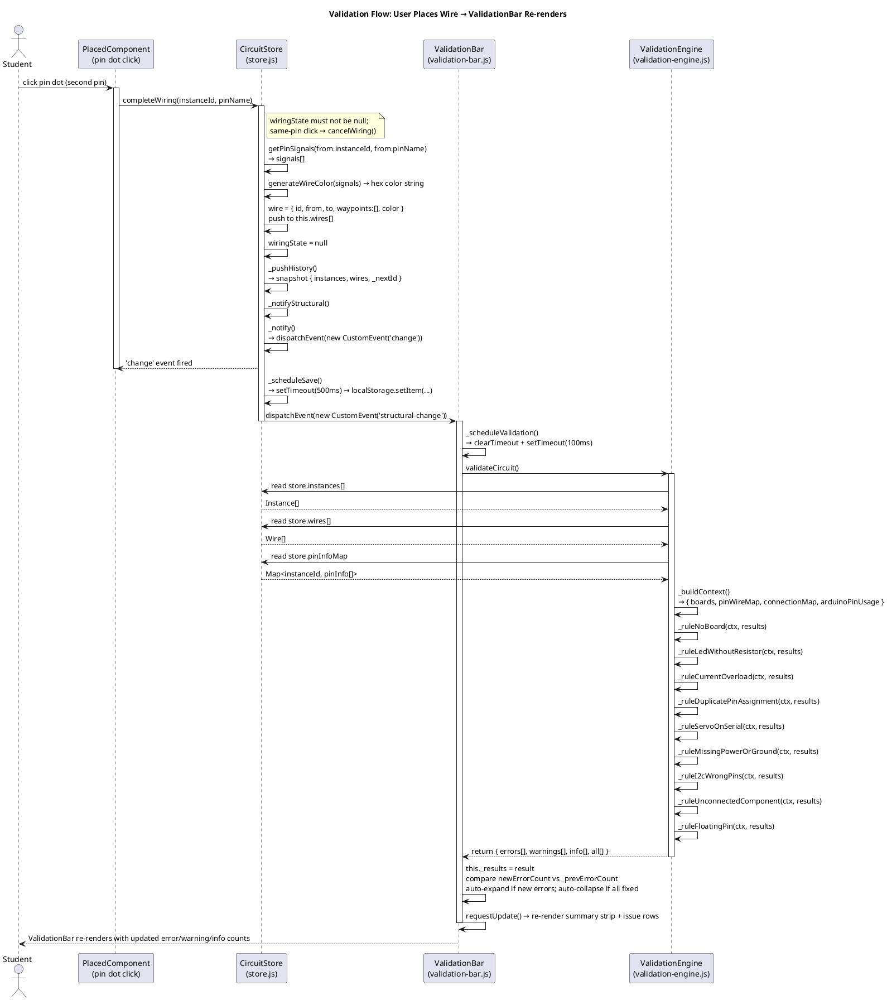

# Diagram 2 — Sequence Diagram (PlantUML)

```plantuml
@startuml
title Validation Flow: User Places Wire → ValidationBar Re-renders

actor Student
participant "PlacedComponent\n(pin dot click)" as PC
participant "CircuitStore\n(store.js)" as ST
participant "ValidationBar\n(validation-bar.js)" as VB
participant "ValidationEngine\n(validation-engine.js)" as VE

Student -> PC : click pin dot (second pin)
activate PC

PC -> ST : completeWiring(instanceId, pinName)
activate ST
note right of ST
  wiringState must not be null;
  same-pin click → cancelWiring()
end note

ST -> ST : getPinSignals(from.instanceId, from.pinName)\n→ signals[]
ST -> ST : generateWireColor(signals) → hex color string
ST -> ST : wire = { id, from, to, waypoints:[], color }\npush to this.wires[]
ST -> ST : wiringState = null
ST -> ST : _pushHistory()\n→ snapshot { instances, wires, _nextId }
ST -> ST : _notifyStructural()

ST -> ST : _notify()\n→ dispatchEvent(new CustomEvent('change'))
ST --> PC : 'change' event fired
deactivate PC

ST -> ST : _scheduleSave()\n→ setTimeout(500ms) → localStorage.setItem(...)

ST -> VB : dispatchEvent(new CustomEvent('structural-change'))
deactivate ST
activate VB

VB -> VB : _scheduleValidation()\n→ clearTimeout + setTimeout(100ms)

VB -> VE : validateCircuit()
activate VE

VE -> ST : read store.instances[]
ST --> VE : Instance[]
VE -> ST : read store.wires[]
ST --> VE : Wire[]
VE -> ST : read store.pinInfoMap
ST --> VE : Map<instanceId, pinInfo[]>

VE -> VE : _buildContext()\n→ { boards, pinWireMap, connectionMap, arduinoPinUsage }
VE -> VE : _ruleNoBoard(ctx, results)
VE -> VE : _ruleLedWithoutResistor(ctx, results)
VE -> VE : _ruleCurrentOverload(ctx, results)
VE -> VE : _ruleDuplicatePinAssignment(ctx, results)
VE -> VE : _ruleServoOnSerial(ctx, results)
VE -> VE : _ruleMissingPowerOrGround(ctx, results)
VE -> VE : _ruleI2cWrongPins(ctx, results)
VE -> VE : _ruleUnconnectedComponent(ctx, results)
VE -> VE : _ruleFloatingPin(ctx, results)

VE --> VB : return { errors[], warnings[], info[], all[] }
deactivate VE

VB -> VB : this._results = result\ncompare newErrorCount vs _prevErrorCount\nauto-expand if new errors; auto-collapse if all fixed
VB -> VB : requestUpdate() → re-render summary strip + issue rows
deactivate VB

Student <-- VB : ValidationBar re-renders with updated error/warning/info counts
@enduml
```
