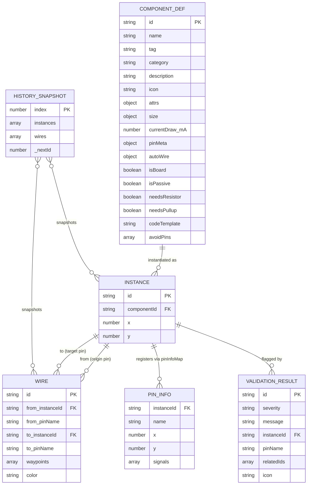

# Diagram 3 — Entity Relationship Diagram (Mermaid erDiagram)

```mermaid
erDiagram
    COMPONENT_DEF {
        string id PK
        string name
        string tag
        string category
        string description
        string icon
        object attrs
        object size
        number currentDraw_mA
        object pinMeta
        object autoWire
        boolean isBoard
        boolean isPassive
        boolean needsResistor
        boolean needsPullup
        string codeTemplate
        array avoidPins
    }

    INSTANCE {
        string id PK
        string componentId FK
        number x
        number y
    }

    WIRE {
        string id PK
        string from_instanceId FK
        string from_pinName
        string to_instanceId FK
        string to_pinName
        array waypoints
        string color
    }

    PIN_INFO {
        string instanceId FK
        string name
        number x
        number y
        array signals
    }

    HISTORY_SNAPSHOT {
        number index PK
        array instances
        array wires
        number _nextId
    }

    VALIDATION_RESULT {
        string id PK
        string severity
        string message
        string instanceId FK
        string pinName
        array relatedIds
        string icon
    }

    COMPONENT_DEF ||--o{ INSTANCE : "instantiated as"
    INSTANCE ||--o{ WIRE : "from (origin pin)"
    INSTANCE ||--o{ WIRE : "to (target pin)"
    INSTANCE ||--o{ PIN_INFO : "registers via pinInfoMap"
    INSTANCE ||--o{ VALIDATION_RESULT : "flagged by"
    HISTORY_SNAPSHOT }o--o{ INSTANCE : "snapshots"
    HISTORY_SNAPSHOT }o--o{ WIRE : "snapshots"
```
