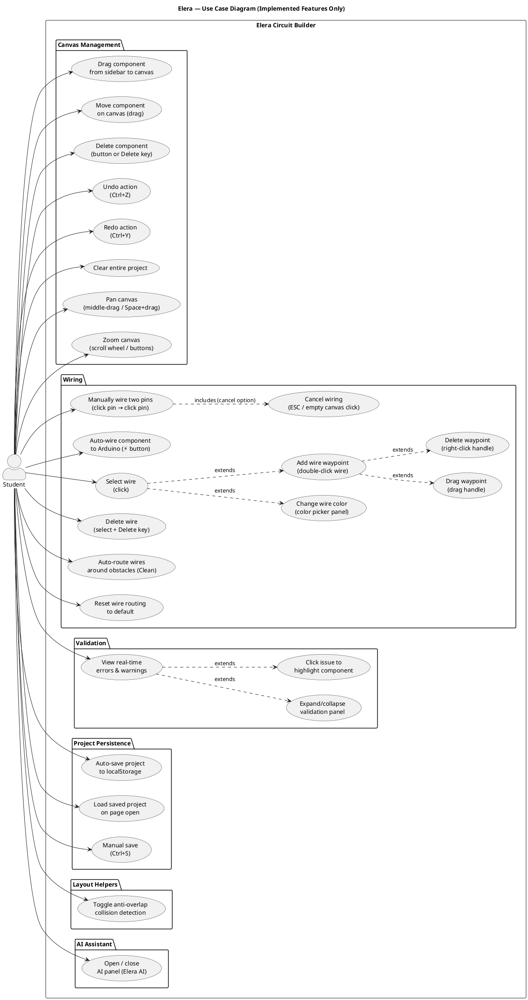

# Diagram 4 — Use Case Diagram (PlantUML)

```plantuml
@startuml
title Elera — Use Case Diagram (Implemented Features Only)

left to right direction
skinparam actorStyle awesome

actor Student

rectangle "Elera Circuit Builder" {

    package "Canvas Management" {
        usecase "Drag component\nfrom sidebar to canvas" as UC1
        usecase "Move component\non canvas (drag)" as UC2
        usecase "Delete component\n(button or Delete key)" as UC3
        usecase "Undo action\n(Ctrl+Z)" as UC4
        usecase "Redo action\n(Ctrl+Y)" as UC5
        usecase "Clear entire project" as UC6
        usecase "Pan canvas\n(middle-drag / Space+drag)" as UC7
        usecase "Zoom canvas\n(scroll wheel / buttons)" as UC8
    }

    package "Wiring" {
        usecase "Manually wire two pins\n(click pin → click pin)" as UC9
        usecase "Cancel wiring\n(ESC / empty canvas click)" as UC10
        usecase "Auto-wire component\nto Arduino (⚡ button)" as UC11
        usecase "Select wire\n(click)" as UC12
        usecase "Change wire color\n(color picker panel)" as UC13
        usecase "Add wire waypoint\n(double-click wire)" as UC14
        usecase "Drag waypoint\n(drag handle)" as UC15
        usecase "Delete waypoint\n(right-click handle)" as UC16
        usecase "Delete wire\n(select + Delete key)" as UC17
        usecase "Auto-route wires\naround obstacles (Clean)" as UC18
        usecase "Reset wire routing\nto default" as UC19
    }

    package "Validation" {
        usecase "View real-time\nerrors & warnings" as UC20
        usecase "Expand/collapse\nvalidation panel" as UC21
        usecase "Click issue to\nhighlight component" as UC22
    }

    package "Project Persistence" {
        usecase "Auto-save project\nto localStorage" as UC23
        usecase "Load saved project\non page open" as UC24
        usecase "Manual save\n(Ctrl+S)" as UC25
    }

    package "Layout Helpers" {
        usecase "Toggle anti-overlap\ncollision detection" as UC26
    }

    package "AI Assistant" {
        usecase "Open / close\nAI panel (Elera AI)" as UC27
    }
}

Student --> UC1
Student --> UC2
Student --> UC3
Student --> UC4
Student --> UC5
Student --> UC6
Student --> UC7
Student --> UC8
Student --> UC9
UC9 ..> UC10 : includes (cancel option)
Student --> UC11
Student --> UC12
UC12 ..> UC13 : extends
UC12 ..> UC14 : extends
UC14 ..> UC15 : extends
UC14 ..> UC16 : extends
Student --> UC17
Student --> UC18
Student --> UC19
Student --> UC20
UC20 ..> UC21 : extends
UC20 ..> UC22 : extends
Student --> UC23
Student --> UC24
Student --> UC25
Student --> UC26
Student --> UC27
@enduml
```
