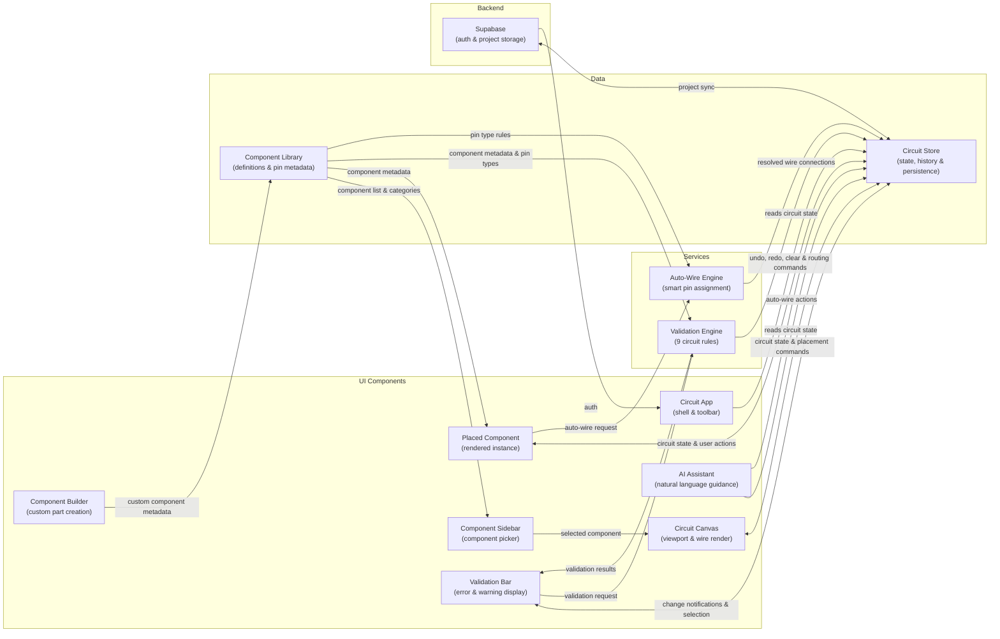
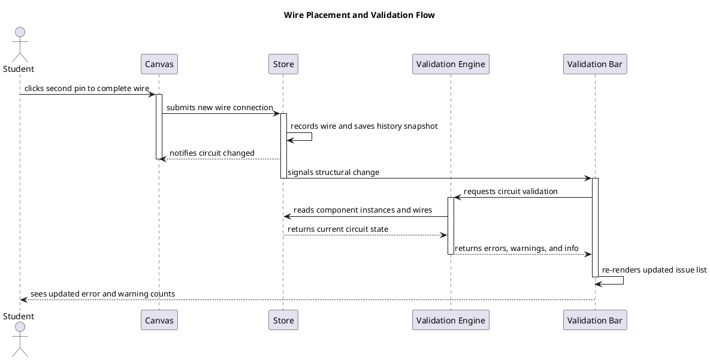
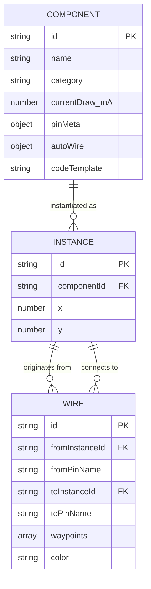
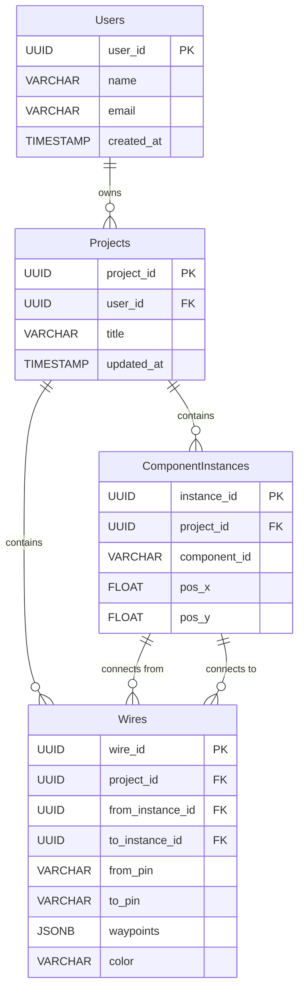
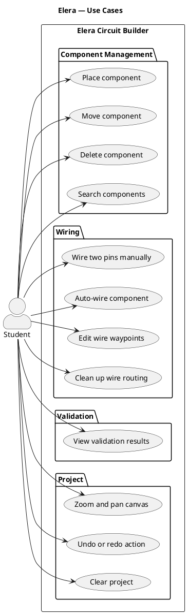

# Diagram 1 — System Architecture (Mermaid flowchart LR)

---

# Diagram 2 — Sequence Diagram (PlantUML)

---

# Diagram 3 — Entity Relationship Diagram (Runtime Model)

---

# Diagram 3B — Entity Relationship Diagram (Supabase PostgreSQL Schema)

---

# Diagram 4 — Use Case Diagram (PlantUML)

