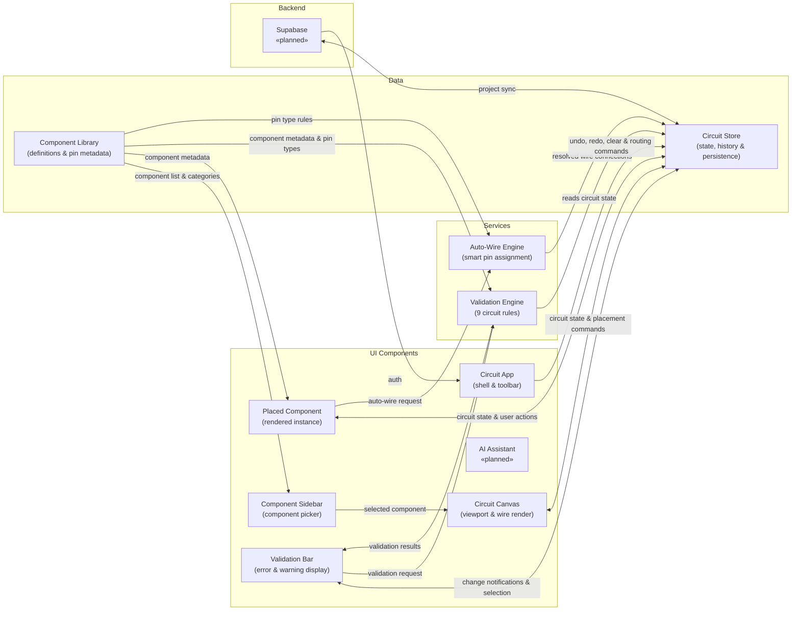
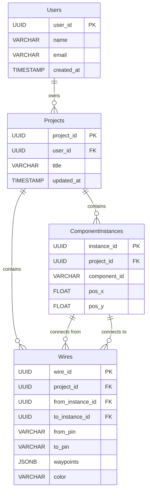

# Diagram 1 — Architecture Diagram (Mermaid flowchart LR)

---

# Diagram 3 — Entity Relationship Diagram (Mermaid erDiagram)
## Planned Supabase PostgreSQL Schema

---

## Self-Check — Architecture Diagram

| Item | Status | Reason for exclusion |
|------|--------|----------------------|
| `wire-path.js` | Excluded | Internal utility used only by `circuit-canvas.js` for SVG path generation; has no independent architectural role and adding it would exceed the 12-node limit |
| `placed-component.js` | Included | Shown as **Placed Component** inside UI subgraph |
| `ai-assistant.js` | Included | Shown as **«planned»** inside UI subgraph |
| `index.js` | Excluded | Entry-point only; imports and registers custom elements, contains no business logic |
| `pinInfoMap` (runtime state) | Excluded | Transient `Map` built at runtime from Wokwi element properties; never persisted, not an architectural concern |
| `wiringState`, `mousePos`, `viewport` | Excluded | Transient store fields; excluded per prior spec and irrelevant to module-level architecture |
| Auto-save to localStorage | Not shown as separate node | Captured under the **Circuit Store** node label "state, history & persistence"; it is an internal behaviour of the store, not a separate module |
| Supabase | Included | Shown as **«planned»** inside Backend subgraph, connected to Store ("project sync") and Circuit App ("auth") |
